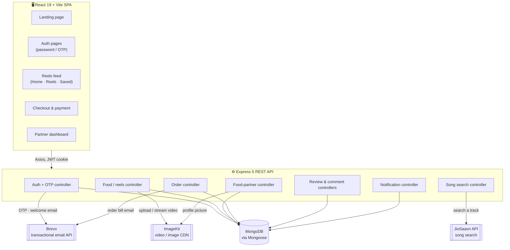
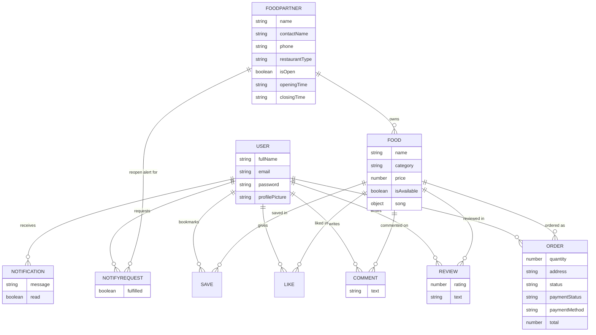
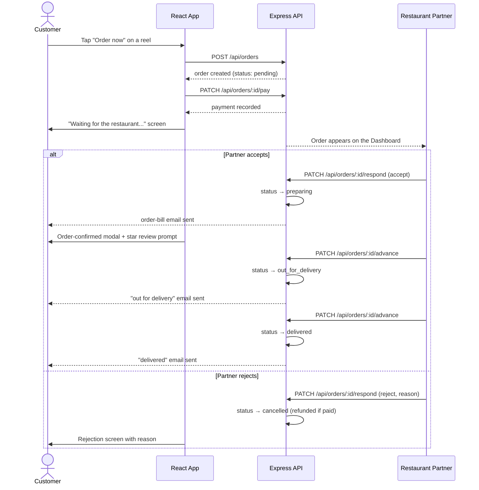
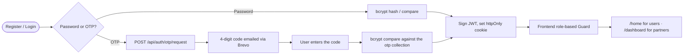

<div align="center">


# ZomaFeeds

**Food, but make it watchable.**

Scroll bite-sized food reels from restaurants near you, then order in a tap — or bring your restaurant onto ZomaFeeds and reach hungry customers instantly.

[](https://nodejs.org)
[](https://expressjs.com)
[](https://react.dev)
[](https://vitejs.dev)
[-47A248?logo=mongodb&logoColor=white)](https://www.mongodb.com)
[](https://jwt.io)
[](#-license)

</div>

---

## 📑 Table of contents

- [Overview](#-overview)
- [Features](#-features)
- [Tech stack](#-tech-stack)
- [Architecture](#-architecture)
- [Data model](#-data-model)
- [Key flows](#-key-flows)
- [Project structure](#-project-structure)
- [Getting started](#-getting-started)
- [Environment variables](#-environment-variables)
- [Deployment notes](#-deployment-notes)
- [API reference](#-api-reference)
- [Design system](#-design-system)
- [Roadmap](#-roadmap)
- [Contributing](#-contributing)
- [Contact](#-contact)

---

## 🍜 Overview

**ZomaFeeds** is a full-stack, two-sided food delivery platform built around a simple idea borrowed from Instagram Reels: **you decide what to eat by watching it, not by reading a menu.**

There are two experiences living in one codebase, guarded by role-based routing:

- **For foodies** — an Instagram-Reels-style vertical feed of real dishes, with likes, saves, comments, star ratings, and a Zomato-style checkout that ends in a live order tracker.
- **For restaurant partners** — a dashboard to run the kitchen: accept/reject orders, toggle open/closed, manage the menu, attach a soundtrack to every reel, and watch ratings and revenue roll in.

Everything — auth, media storage, email, and even the background music search — is wired to real, working services (MongoDB, ImageKit, Brevo, a self-hosted JioSaavn API), not mocked stubs.

---

## ✨ Features

### 🧑‍🍳 For foodies

| | |
|---|---|
| 🎬 | **Reels-first discovery** — a vertical, swipeable feed of food videos (IntersectionObserver-driven autoplay), instead of a boring list of restaurants |
| ❤️ | **Like, save & comment** on any reel, with live counts |
| ⭐ | **Dish + restaurant ratings** — every reel shows its own average rating, and checkout shows both the dish's rating and the restaurant's overall rating |
| 🔎 | **Smart Home feed** — top-ranked dishes by popularity by default; the full restaurant directory only appears once you start searching |
| 🛒 | **Zomato-style checkout** — quantity stepper (drops the item once you go below 1), delivery address, live bill summary |
| 💳 | **Dummy payment flow** — pay by UPI, Card, or Cash on Delivery (no real money ever moves) |
| 📦 | **Live order tracking** — `pending → preparing → out for delivery → delivered`, with a waiting screen while the restaurant decides |
| 🌟 | **Post-order review prompt** — a 1–5 star review modal opens the moment your order is accepted |
| 🔔 | **"Notify me" for closed restaurants** — get an in-app notification the second they reopen |
| 🔑 | **Password *or* OTP auth** — register/log in with a password, or a 4-digit code emailed to you; both work everywhere |
| 🔈 | **Reel sound control** — a reel plays its own audio by default; if the partner attached a song, the video mutes and the song plays instead, all behind one global mute toggle |
| 🖱️ | **Desktop-friendly navigation** — the scrollbar is hidden in favour of on-screen ▲▼ buttons and ↑/↓ keyboard shortcuts to move between reels; mobile keeps its native swipe |
| 🌗 | **Light/dark theme**, tuned to the brand palette, remembered across visits |

### 🍽️ For restaurant partners

| | |
|---|---|
| 📊 | **Dashboard-first login** — lands straight on a dashboard, not a bare menu list |
| 🟢 | **Open/Closed switch** — flip your restaurant's status any time, independent of your configured hours |
| 🕘 | **Order buckets** — Today / Yesterday / Past, each with orders-served and revenue stats |
| ✅❌ | **Accept / Reject workflow** — accepting moves the order into your kitchen queue; rejecting requires a reason and auto-refunds a paid order |
| 🚚 | **One-tap status advance** — `preparing → out for delivery → delivered`, each step emailing the customer |
| 🍕 | **Full menu control** — add, edit (name, description, price, category, availability), or delete any item |
| 🎬 | **Reel length limit** — uploads must be 5–30 seconds, checked the moment a video is selected |
| 🎵 | **Instagram-style song trimming** — search a track, drag a waveform window to pick where it starts, tap the circular timer to set the clip length (5–30s, capped to the video's own length), then preview before attaching |
| ⭐ | **Per-item and restaurant-wide ratings** visible right on the dashboard and profile |
| 🔄 | **Live-updating dashboard** — incoming orders refresh automatically every few seconds; no manual reload to see a new one land |
| 🏪 | **Editable business profile** — name, contact, phone, address, restaurant type, photo |
| 📧 | **Branded automatic emails** — a welcome email on signup, then order-bill, out-for-delivery, and delivered emails as the order moves through its lifecycle |

### 🛠️ Under the hood

- **Role-based route guards** on the frontend (`Guard`) — a customer can never render a partner-only page and vice versa.
- **`InternalOnly` navigation guard** — the pre-auth register/login screens only render when reached by clicking through the app; typing the URL directly (or bookmarking it) bounces you back to the landing page.
- **HTTP-only JWT cookies** for auth, checked against MongoDB on every protected request.
- **Password *and* OTP are first-class** on both register and login, for both roles — bcrypt-hashed either way.
- **`validateModifiedOnly` Mongoose pattern** on every partial update, so a legacy document missing a newer required field never blocks an unrelated edit.
- **Every auth/food/order endpoint is try/catch-wrapped**, returning a real JSON error message instead of letting Express's default HTML error page mask what actually failed.
- **Song clips are clamped server-side too** (5–30s, never negative) — the frontend's trim UI is a convenience, not the only line of defence.
- Every design decision is CSS-scoped: no monolithic stylesheet — each feature owns its own file under `frontend/src/styles/`.

---

## 🧰 Tech stack

| Layer | Technology |
|---|---|
| **Frontend** | React 19, Vite 7, React Router 7, Axios, `lucide-react` icons |
| **Backend** | Node.js, Express 5 |
| **Database** | MongoDB, Mongoose 8 (ODM) |
| **Auth** | JWT (`httpOnly` cookies), `bcryptjs` for password + OTP hashing |
| **File uploads** | Multer (in-memory) → ImageKit (video/image CDN) |
| **Email** | Brevo transactional email API (HTTPS, not SMTP — avoids the outbound SMTP port blocks free hosts like Render impose) |
| **Music search** | JioSaavn API (self-hosted instance) |
| **Linting** | ESLint 9 (flat config) |

---

## 🏗️ Architecture



---

## 🗂️ Data model



---

## 🔁 Key flows

### Order lifecycle



### Dual auth: password or OTP



---

## 📁 Project structure

```text
ZomaFeeds/
├── backend/
│   ├── server.js                 # entrypoint — loads .env, connects DB, starts Express
│   └── src/
│       ├── app.js                # express app, middleware, route mounting
│       ├── db/db.js              # mongoose connection
│       ├── controllers/          # one controller per resource (auth, food, order, review...)
│       ├── models/                # mongoose schemas
│       ├── routes/                # express routers, wired to controllers + middleware
│       ├── middlewares/           # authUserMiddleware / authFoodPartnerMiddleware / authAnyMiddleware
│       └── services/              # storage (ImageKit), mail (Brevo), otp
│
└── frontend/
    └── src/
        ├── App.jsx                # theme provider + route tree
        ├── routes/AppRoutes.jsx   # all routes, Guard + InternalOnly wrappers
        ├── pages/
        │   ├── auth/               # LandingPage, UserLogin/Register, FoodPartnerLogin/Register
        │   ├── general/            # Home, Reels, Saved, OrderPage, PaymentPage, UserProfile
        │   └── food-partner/       # Dashboard, CreateFood, ManageFood, Profile
        ├── components/            # ReelFeed, SongPicker, PageNav, BottomNav, OrderConfirmModal...
        ├── config/                 # axios instance, cart helpers
        └── styles/                 # one CSS file per feature — no monolithic stylesheet
```

---

## 🚀 Getting started

### Prerequisites

- **Node.js** 18+ and npm
- A **MongoDB** instance (local or Atlas)
- An **ImageKit** account (for video/image storage)
- A **Brevo** account with a verified sender email and an API key (for transactional email)
- A reachable **JioSaavn API** instance (public or self-hosted) for song search

### Clone

```bash
git clone https://github.com/titoo9201/ZomaFeeds.git
cd ZomaFeeds
```

### Backend

```bash
cd backend
npm install
```

Create `backend/.env` (see [Environment variables](#-environment-variables) below), then:

```bash
npm run dev        # nodemon server.js — http://localhost:3000
```

### Frontend

```bash
cd frontend
npm install
npm run dev         # http://localhost:5173
```

### Production build (frontend)

```bash
npm run build        # outputs to frontend/dist
npm run preview       # preview the production build locally
```

---

## 🔐 Environment variables

Create a `.env` file inside `backend/` — **it is git-ignored and must never be committed.**

| Variable | Required | Purpose |
|---|---|---|
| `FRONTEND_URL` | ✅ | Origin allowed by CORS (e.g. `http://localhost:5173`) |
| `JWT_SECRET` | ✅ | Secret used to sign/verify auth cookies |
| `MONGODB_URL` | ✅ | MongoDB connection string |
| `IMAGEKIT_PUBLIC_KEY` | ✅ | ImageKit public key |
| `IMAGEKIT_PRIVATE_KEY` | ✅ | ImageKit private key |
| `IMAGEKIT_URL_ENDPOINT` | ✅ | ImageKit delivery URL endpoint |
| `SAAVN_API_BASE_URL` | ✅ | Base URL of a JioSaavn-compatible search API |
| `MAIL_USER` | ✅ | Sender email address — must be verified as a Sender in Brevo |
| `BREVO_API_KEY` | ✅ | Brevo transactional email API key |

> Email is sent over Brevo's HTTPS API rather than raw SMTP — free hosts like Render block outbound SMTP ports, which silently breaks Nodemailer/Gmail in production. If `MAIL_USER` / `BREVO_API_KEY` are left unset, the mail service no-ops with a console warning instead of crashing — everything else keeps working.

---

## 🚢 Deployment notes

A few things learned the hard way while deploying to Render — worth knowing wherever this ends up hosted:

- **SPA routing needs an explicit rewrite rule.** A static host has no idea `/user/login` or `/dashboard` are client-side routes — refreshing or deep-linking to one 404s unless every path falls back to `index.html`. `frontend/public/_redirects` (`/* /index.html 200`) covers Netlify-style hosts automatically; on Render specifically, also add the same rule under the site's **Redirects/Rewrites** dashboard tab (Source `/*` → Destination `/index.html` → Action `Rewrite`), since the file isn't always picked up on its own.
- **`.env` never reaches the host.** It's git-ignored on purpose, so every variable in [Environment variables](#-environment-variables) has to be added by hand in the host's dashboard (e.g. Render → your service → **Environment**) — forgetting one fails silently or throws a generic 500 instead of a clear error.
- **Free-tier services sleep.** Render (and similar free tiers) spin a service down after ~15 minutes of inactivity; the next request 502s while it cold-starts back up. Point a free uptime monitor (UptimeRobot, cron-job.org, …) at `GET /` for both the backend and the JioSaavn API instance, on a 5-minute interval, to keep them warm.
- **Prefer an HTTPS email API over raw SMTP.** Most free hosts block outbound SMTP ports outright, which silently breaks password-based senders like Nodemailer/Gmail in production — exactly why email goes through Brevo's HTTPS API here instead.

---

## 📡 API reference

All protected routes read a JWT from an `httpOnly` cookie set at login. `user` and `foodPartner` are two separate roles with separate cookies/guards.

<details>
<summary><strong>Auth — <code>/api/auth</code></strong></summary>

| Method | Path | Auth | Description |
|---|---|---|---|
| GET | `/me` | — | Returns the current session (role + basic info), or `null` |
| POST | `/otp/request` | — | Emails a 4-digit OTP for register or login |
| POST | `/user/register` | — | Register a user (password and/or OTP) |
| POST | `/user/login` | — | Log in a user (password or OTP) |
| GET | `/user/logout` | user | Clear the session cookie |
| GET | `/user/profile` | user | Get the logged-in user's profile |
| PATCH | `/user/profile` | user | Update name / email / picture |
| POST | `/food-partner/register` | — | Register a restaurant partner |
| POST | `/food-partner/login` | — | Log in a restaurant partner |
| GET | `/food-partner/logout` | foodPartner | Clear the session cookie |

</details>

<details>
<summary><strong>Food / reels — <code>/api/food</code></strong></summary>

| Method | Path | Auth | Description |
|---|---|---|---|
| POST | `/` | foodPartner | Upload a new reel (video + song optional) |
| GET | `/` | user | List every reel, enriched with liked/saved/rating |
| POST | `/like` | user | Toggle like on a food item |
| POST | `/save` | user | Toggle save on a food item |
| GET | `/save` | user | List the user's saved reels |
| PATCH | `/:id` | foodPartner | Edit name/description/price/category/availability/song |
| DELETE | `/:id` | foodPartner | Delete an owned item |

</details>

<details>
<summary><strong>Food partners — <code>/api/food-partner</code></strong></summary>

| Method | Path | Auth | Description |
|---|---|---|---|
| GET | `/` | user | List all partners, ranked by popularity |
| GET | `/me` | foodPartner | Own profile + menu + stats |
| PATCH | `/me` | foodPartner | Update business profile |
| PATCH | `/me/hours` | foodPartner | Toggle open/closed and/or update hours |
| POST | `/:id/notify-me` | user | Ask to be notified when a closed restaurant reopens |
| GET | `/:id` | user | Public partner profile + menu |

</details>

<details>
<summary><strong>Orders — <code>/api/orders</code></strong></summary>

| Method | Path | Auth | Description |
|---|---|---|---|
| POST | `/` | user | Place an order (blocked if closed/unavailable) |
| GET | `/my` | user | The user's order history |
| GET | `/partner/incoming?days=` | foodPartner | Orders bucketed into Today/Yesterday/Past + stats |
| GET | `/:id` | user | A single order |
| PATCH | `/:id/pay` | user | Dummy payment (UPI/Card/COD) |
| PATCH | `/:id/respond` | foodPartner | Accept or reject a pending order |
| PATCH | `/:id/advance` | foodPartner | Advance status one step forward |

</details>

<details>
<summary><strong>Reviews & comments</strong></summary>

| Method | Path | Auth | Description |
|---|---|---|---|
| POST | `/api/reviews` | user | 1–5 star review (only after an accepted order) |
| GET | `/api/reviews/:foodId` | any | Reviews + average rating for a dish |
| POST | `/api/comments` | user | Add a comment |
| GET | `/api/comments/:foodId` | user | List comments |
| DELETE | `/api/comments/:id` | user | Delete your own comment |

</details>

<details>
<summary><strong>Notifications & songs</strong></summary>

| Method | Path | Auth | Description |
|---|---|---|---|
| GET | `/api/notifications/my` | user | List in-app notifications |
| PATCH | `/api/notifications/:id/read` | user | Mark one as read |
| GET | `/api/songs/search?query=` | foodPartner | Search a track to attach to a reel |

</details>

---

## 🎨 Design system

- **Palette** — pulled straight from the ZomaFeeds mark: a warm coral → red → pink → purple gradient (`#F56A4C → #E23744 → #C13584 → #833AB4`) on a cream ground.
- **Light theme** — warm ivory background, warm near-black text for strong contrast.
- **Dark theme** — a soft charcoal-maroon ground instead of flat black, with brightened brand accents so the gradient still pops.
- Every feature's styles live in their own file under `frontend/src/styles/` — there is no catch-all stylesheet to fight over.

---

## 🗺️ Roadmap

- [ ] Real payment gateway integration (Razorpay/Stripe) behind the existing dummy-payment UI
- [ ] Push notifications (web push) alongside in-app notifications
- [ ] Admin/moderation panel for reported reels and reviews
- [ ] Order history export beyond the current 6-month self-serve window

---

## 🤝 Contributing

1. Fork the repo and create a feature branch: `git checkout -b feature/my-feature`
2. Commit your changes with a clear message
3. Push and open a Pull Request describing what changed and why

---

## 📄 License

No open-source license has been published for this project yet — all rights reserved by the author.

---

## 📬 Contact

<div align="center">

**Built by Titoo Singh**

[](mailto:titoos67@gmail.com)
[](https://github.com/titoo9201)
[](https://www.instagram.com/titoo_9201/)
[](https://www.linkedin.com/in/titoo-singh-dev/)

**ZomaFeeds team:** [zomafeeds@gmail.com](mailto:zomafeeds@gmail.com)

</div>
