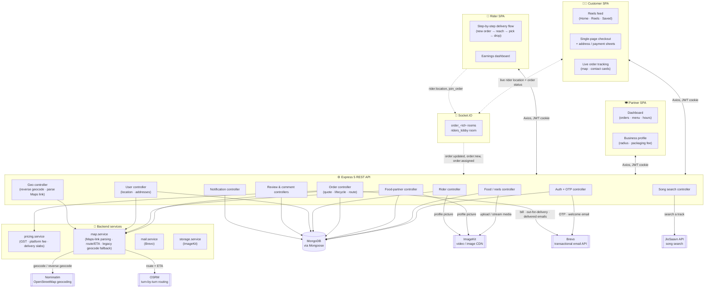
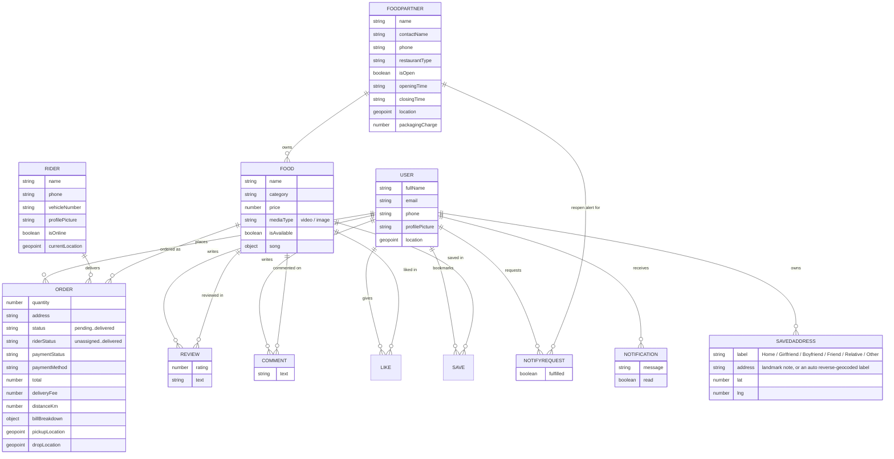
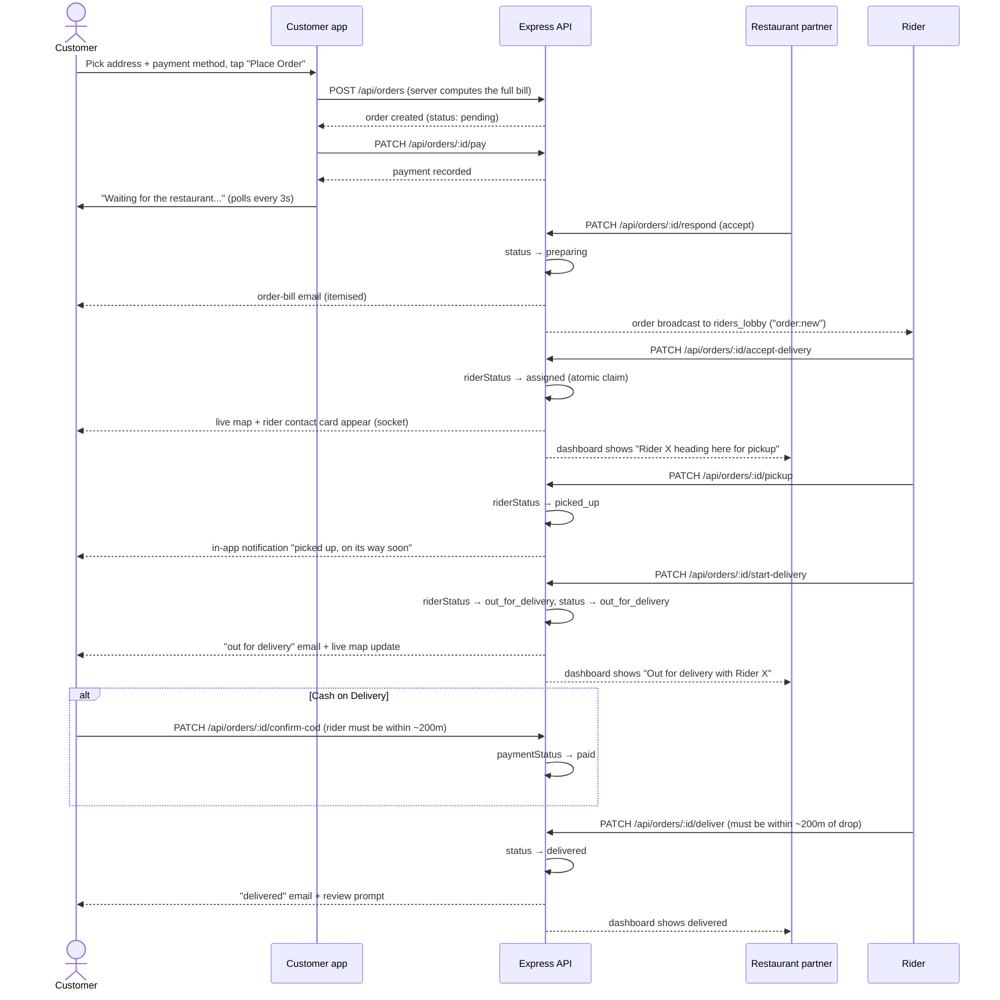
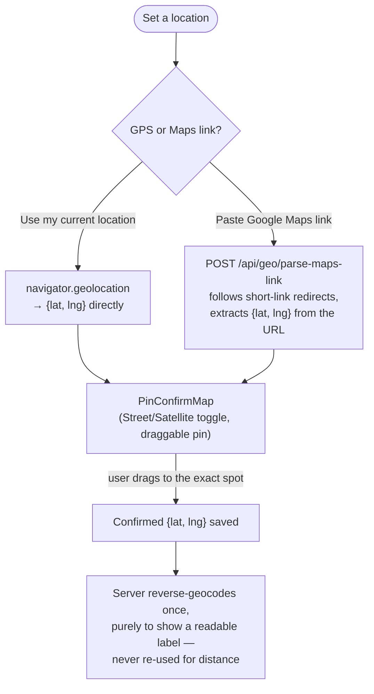
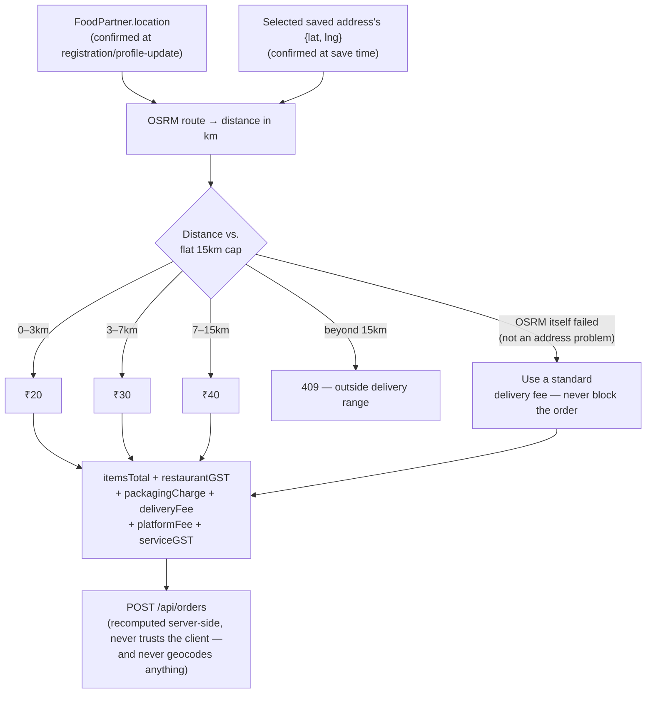
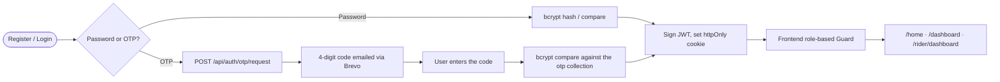

<div align="center">


# ZomaFeeds

**Food, but make it watchable.**

Scroll bite-sized food reels from restaurants near you, order in a tap, and watch a real rider carry it to your door on a live map — or bring your restaurant or your bike onto ZomaFeeds and start earning instantly.

[](https://nodejs.org)
[](https://expressjs.com)
[](https://react.dev)
[](https://vitejs.dev)
[-47A248?logo=mongodb&logoColor=white)](https://www.mongodb.com)
[](https://socket.io)
[](https://leafletjs.com)
[](https://jwt.io)
[](#-features)
[](#-license)

</div>

---

## 📑 Table of contents

- [Overview](#-overview)
- [Features](#-features)
- [Tech stack](#-tech-stack)
- [Architecture](#-architecture)
- [Data model](#-data-model)
- [Key flows](#-key-flows)
- [Bill breakdown](#-bill-breakdown)
- [Project structure](#-project-structure)
- [Getting started](#-getting-started)
- [Environment variables](#-environment-variables)
- [Deployment notes](#-deployment-notes)
- [API reference](#-api-reference)
- [Design system](#-design-system)
- [Roadmap](#-roadmap)
- [Contributing](#-contributing)
- [Contact](#-contact)

---

## 🍜 Overview

**ZomaFeeds** is a full-stack, **three-sided** food delivery platform built around a simple idea borrowed from Instagram Reels: **you decide what to eat by watching it, not by reading a menu** — and then you watch it actually arrive, live, on a map.

Three experiences live in one codebase, each behind its own role-based route guard and its own auth cookie:

- **For foodies** — an Instagram-Reels-style vertical feed of real dishes, saved-address book, a Zomato-style single-page checkout with a full GST/fee breakdown, and a live order tracker that shows a real rider gliding toward you.
- **For restaurant partners** — a dashboard to run the kitchen: accept/reject orders, toggle open/closed, manage the menu, set a packaging charge, attach a soundtrack to every reel, and see exactly which rider picked up which order.
- **For delivery riders** — a Rapido/Zomato-style step-by-step delivery flow: a full-screen "New order!" card with a live distance breakdown, Accept/Deny, "Reach pickup" → "Pick order" → "Reach drop" → "Drop order", each with one-tap navigation, calling, and a Today/Yesterday/Past earnings dashboard.

Everything — auth, media storage, email, real-time location, routing, geocoding, and even the background music search — is wired to real, working services (MongoDB, ImageKit, Brevo, OpenStreetMap/OSRM, a self-hosted JioSaavn API), not mocked stubs. Payment is intentionally a dummy flow (UPI/Card/COD selection with a realistic bill), since no real payment gateway is wired in — see [Roadmap](#-roadmap).

---

## ✨ Features

### 🧑‍🍳 For foodies

| | |
|---|---|
| 🎬 | **Reels-first discovery** — a vertical, swipeable feed of food videos *or photos* (IntersectionObserver-driven autoplay), instead of a boring list of restaurants |
| 📍 | **Radius-aware Home feed** — restaurants are only shown if you're within a flat 15km of your saved location (`$geoNear`), sorted by rating; set it by picking one of your saved addresses from a dropdown, or by confirming a brand new GPS/Maps-link pin (which can then optionally be added to your address book too, under an existing or new label) — the same address system used at checkout, not a separate one-off flow |
| ❤️💬🔖 | **Like, save & comment** on any reel, with live counts, comment avatars, an Instagram-style comment sheet (video shrinks to a corner while comments take over), and long-press-to-delete your own comment |
| ⭐ | **Dish + restaurant ratings** — every reel shows its own average rating, and checkout shows both the dish's rating and the restaurant's overall rating |
| 🏠💌 | **Labelled address book** — save multiple delivery addresses (Home, Girlfriend, Boyfriend, Friend, Relative, Other), each set from your live GPS location *or* a pasted Google Maps link, confirmed on a draggable-pin map (Street/Satellite toggle) before it's saved — no address text to mistype or mis-geocode |
| 🛒 | **Single-page Zomato-style checkout** — item + quantity stepper, an address-picker sheet and a payment-method sheet both surfaced from a sticky bottom bar, with a live bill preview *before* you place the order |
| 🧾 | **Full itemised bill** — item total → restaurant GST (5%) → packaging charge (if the restaurant charges one) → distance-based delivery fee → platform fee → GST on fees (18%) → grand total. See [Bill breakdown](#-bill-breakdown) |
| 💳 | **Dummy payment flow** — pay by UPI, Card, or Cash on Delivery (no real money ever moves); a COD order isn't marked "delivered" until you confirm in-app that you handed over the cash |
| 🛵🗺️ | **Live order tracking** — a real Leaflet/OpenStreetMap route from the moment the order is placed (pickup → drop preview), a rider marker that **glides and rotates to face the direction of travel** once a rider is assigned, restaurant/rider contact cards with one-tap `tel:` calling |
| 🔗 | **A "Track" nav icon** that only appears while an order is actually in flight (same pattern as the cart icon), so the tracking screen is never more than one tap away — and disappears again once delivered |
| 🌟 | **Post-delivery review prompt** — a 1–5 star review modal opens the moment your order is marked *delivered*, for both UPI and COD |
| 🔔 | **"Notify me" for closed restaurants** — get an in-app notification the second they reopen, plus a notification when your rider picks up your food |
| 🔑 | **Password *or* OTP auth** — register/log in with a password, or a 4-digit code emailed to you; works for all three roles |
| 🔈 | **Reel sound control** — a reel plays its own audio by default; if the partner attached a song, the video mutes and the song plays instead, all behind one global mute toggle |
| 📲 | **Installable PWA** — a real manifest + service worker, so Chrome/Android offer "Install app" instead of just "Create shortcut" |
| 🌗 | **Light/dark theme**, tuned to the brand palette, remembered across visits |

### 🍽️ For restaurant partners

| | |
|---|---|
| 📊 | **Dashboard-first login** — lands straight on a dashboard, not a bare menu list |
| 🟢 | **Open/Closed switch** — flip your restaurant's status any time, independent of your configured hours |
| 🕘 | **Order buckets** — Today / Yesterday / Past, each with orders-served and revenue stats (your real 75%+ share of the item price, not the customer's full bill) |
| ✅❌ | **Accept / Reject workflow** — accepting moves the order into your kitchen queue (delivery pricing is already settled at order time, straight off your and the customer's confirmed map pins — no geocoding involved); rejecting requires a reason and auto-refunds a paid order |
| 🚚🛵 | **See exactly who's delivering** — once a rider claims the order, the dashboard shows their name and live status ("heading here for pickup" → "out for delivery with …") instead of a dead-end "advance" button |
| 📦💰 | **Optional packaging charge** — a flat per-order fee you control, shown as its own line item on every customer bill |
| 📍 | **Flat 15km delivery range** — a platform-wide cap, the same for every restaurant; customers outside it never see you in their feed, and orders from out-of-range addresses are politely rejected at checkout |
| 🍕 | **Full menu control** — add, edit (name, description, price, category, availability), or delete any item; upload a **photo or a video** for each reel |
| 🎬 | **Reel length limit** — video uploads must be 5–30 seconds, checked the moment a file is selected |
| 🎵 | **Instagram-style song trimming** — search a track, drag a waveform window to pick where it starts, tap the circular timer to set the clip length (5–30s, capped to the video's own length), then preview before attaching |
| ⭐💬 | **Per-item and restaurant-wide ratings**, plus a read-only view of every comment and like count on your own reels |
| 🔄 | **Live-updating dashboard** — incoming orders refresh automatically every few seconds; no manual reload to see a new one land |
| 🏪 | **Editable business profile** — name, contact, phone, location (GPS or a pasted Google Maps link, confirmed on a draggable-pin map), restaurant type, packaging charge, photo |
| 📧 | **Branded automatic emails** — a welcome email on signup, then an itemised order-bill email, out-for-delivery, and delivered emails as the order moves through its lifecycle |

### 🛵 For delivery riders

| | |
|---|---|
| 🌙🌗 | **Rapido/Zomato-style delivery flow** — one full-screen step at a time instead of a list: **New order!** (dark theme, circular map, trip/pickup/drop distance breakdown, Accept/Deny) → **Reach pickup** (live map, call the restaurant, Navigate) → **Pick order** (order ID, item breakdown, collapsible restaurant/customer details) → **Reach drop** (live map, call the customer) → **Drop order** (payment-status badge, "Order delivered") |
| 🧭 | **"Navigate" hands off to Google Maps** — a one-tap deep link (`google.com/maps/dir/?api=1&destination=…&travelmode=driving`) opens turn-by-turn driving directions in the Google Maps app (or a new tab on desktop), using the phone's own live GPS as the starting point; the in-app Leaflet map stays alongside it purely as an overview, not a replacement |
| 🛰️ | **Real GPS tracking** — `navigator.geolocation.watchPosition`, throttled to the server every 15s (plus an immediate first fix), broadcast live over Socket.IO to the customer's tracking screen |
| 🧭 | **Direction-aware marker** — the bike icon computes its bearing from the last GPS fix (`atan2`) and rotates to face the way the rider is actually moving, while the marker itself glides smoothly (`requestAnimationFrame` tween) instead of snapping between fixes |
| 🔒 | **Proximity-gated actions** — "Delivered" only unlocks once the rider's live location is within ~200m of the drop point; for Cash on Delivery, it stays locked until the *customer* confirms the cash handover from their own tracking screen |
| 🖼️ | **Profile picture, phone & vehicle number** — visible to the customer on their tracking screen, with a one-tap `tel:` call button |
| 💰 | **Today / Yesterday / Past earnings** — the same three-bucket stat-card pattern as the restaurant dashboard, driven by the actual distance-based delivery fee earned per completed delivery |
| 🚫 | **Distance-slab delivery pricing built in** — ₹20 (0–3 km) / ₹30 (3–7 km) / ₹40 (7–15 km), capped by the platform-wide 15km limit; an address that's genuinely out of range is rejected *before* a rider ever sees it |

### 🛠️ Under the hood

- **Role-based route guards** on the frontend (`Guard`) for all three roles — a customer, partner, or rider can never render another role's page.
- **`InternalOnly` navigation guard** — the pre-auth register/login screens only render when reached by clicking through the app; typing the URL directly (or bookmarking it) bounces you back to the landing page.
- **HTTP-only JWT cookies** for auth, checked against MongoDB on every protected request; Socket.IO connections are authenticated by reading the same cookie off the handshake.
- **Password *and* OTP are first-class** on register and login, for all three roles — bcrypt-hashed either way.
- **Atomic, race-safe delivery claiming** — `acceptDelivery` is a single `findOneAndUpdate` guarded by `rider: null`, so two riders tapping "Accept" on the same order at the same instant can never both win it.
- **GPS/Google-Maps-link only, not free-text geocoding** — restaurant locations, saved delivery addresses, and every order's pickup/drop point all come from the phone's own GPS or a pasted Google Maps link (`POST /api/geo/parse-maps-link` extracts `{lat, lng}` from the URL, following short-link redirects server-side), each confirmed on a draggable-pin map before it's saved. Geocoding a typed address by text turned out to be unreliable for small Indian localities (two real addresses in the same "Ganga Puram" locality once resolved ~17km apart), so order creation never geocodes anything — it always reads the already-stored, human-confirmed coordinates on both ends. The old Nominatim address→coordinates geocoder still exists in `map.service.js` purely as a fallback for the Home-feed "enter address manually" box.
- **Server is the only source of truth for money** — every rupee of a bill (item total, restaurant GST, packaging charge, delivery fee, platform fee, GST on fees) is computed in `pricing.service.js` at order-creation time; the client only ever *previews* a bill via `/api/orders/quote`.
- **`validateModifiedOnly` Mongoose pattern** on every partial update, so a legacy document missing a newer required field never blocks an unrelated edit.
- **Every endpoint is try/catch-wrapped**, returning a real JSON error message instead of letting Express's default HTML error page mask what actually failed.
- Every feature's styles live in their own file under `frontend/src/styles/` — there is no catch-all stylesheet to fight over.

---

## 🧰 Tech stack

| Layer | Technology |
|---|---|
| **Frontend** | React 19, Vite 7, React Router 7, Axios, `lucide-react` icons, `react-leaflet` 5 |
| **Backend** | Node.js, Express 5, Socket.IO 4 |
| **Database** | MongoDB, Mongoose 8 (ODM) |
| **Real-time** | Socket.IO — JWT-cookie-authenticated connections, per-order (`order_<id>`) and per-role (`riders_lobby`) rooms |
| **Maps & routing** | Leaflet + OpenStreetMap tiles, Esri World Imagery satellite (client); OSRM turn-by-turn routing + Nominatim (legacy fallback only) geocoding (server, all free/public); Google Maps deep links for rider turn-by-turn navigation (no API key — plain URLs) |
| **Auth** | JWT (`httpOnly` cookies), `bcryptjs` for password + OTP hashing |
| **File uploads** | Multer (in-memory) → ImageKit (video/image CDN) |
| **Email** | Brevo transactional email API (HTTPS, not SMTP — avoids the outbound SMTP port blocks free hosts like Render impose) |
| **Music search** | JioSaavn API (self-hosted instance) |
| **PWA** | Web app manifest + a minimal pass-through service worker (no caching, to avoid staleness) |
| **Linting** | ESLint 9 (flat config) |

---

## 🏗️ Architecture



---

## 🗂️ Data model



---

## 🔁 Key flows

### Order lifecycle — order → restaurant → rider → delivered

Every arrow that crosses into the customer's tracking screen after the initial "waiting" poll travels over the same Socket.IO room (`order_<id>`), so the map, status text, and contact cards all update **live**, with no page refresh.



### Location capture — GPS or a Google Maps link, confirmed on a map

Every location on the platform — a restaurant's own address, a customer's saved delivery address, or the Home-feed location used for the 15km radius feed — is captured the same way, with no free-text address ever geocoded. The Home-feed picker (`LocationPrompt`) reuses this exact flow: pick an existing saved address instantly, or confirm a new pin and optionally save it into the address book under an existing or new label:



### Delivery pricing — from confirmed pins to a rejected-or-accepted order



### Dual auth: password or OTP (all three roles)



---

## 🧾 Bill breakdown

Every order's `total` is the sum of six independently-stored fields, computed once, server-side, at order creation (`pricing.service.js`) — never trusted from the client:

| Component | How it's calculated | Who it belongs to |
|---|---|---|
| **Item total** | `price × quantity` | The restaurant |
| **Restaurant GST** | 5% of item total | Passed through to tax |
| **Packaging charge** | Flat, set by the restaurant (default ₹0) | The restaurant |
| **Delivery fee** | Distance slab: ₹20 (0–3km) / ₹30 (3–7km) / ₹40 (7–15km) | The rider (their entire earning per delivery) |
| **Platform fee** | Flat ₹6 per order | ZomaFeeds |
| **GST on fees** | 18% of (delivery fee + platform fee) | Passed through to tax |

A restaurant's dashboard revenue is its item-total share (not the customer's full bill); a rider's earnings dashboard sums exactly the delivery fee of every order they've completed. All three rate constants live in one place (`backend/src/config/pricingConfig.js`) so they can be tuned without touching the calculation logic.

---

## 📁 Project structure

```text
ZomaFeeds/
├── backend/
│   ├── server.js                 # entrypoint — loads .env, connects DB, wraps app with an HTTP server + Socket.IO
│   └── src/
│       ├── app.js                # express app, middleware, route mounting
│       ├── socket.js             # Socket.IO server — JWT-cookie auth, order_<id> and riders_lobby rooms
│       ├── db/db.js              # mongoose connection
│       ├── config/
│       │   └── pricingConfig.js  # GST rates, platform fee, fallback delivery fee — tune in one place
│       ├── controllers/          # auth, food, food-partner, order, rider, user, geo, review, comment, song, notification
│       ├── models/                # mongoose schemas (user, foodpartner, rider, food, order, review, comment, ...)
│       ├── routes/                # express routers, wired to controllers + middleware
│       ├── middlewares/           # authUserMiddleware / authFoodPartnerMiddleware / authRiderMiddleware / authAnyMiddleware
│       └── services/              # storage (ImageKit), mail (Brevo), otp, map (Maps-link parsing/route/legacy geocode), pricing
│
└── frontend/
    └── src/
        ├── App.jsx                # theme provider + route tree
        ├── routes/AppRoutes.jsx   # all routes for all three roles, Guard + InternalOnly wrappers
        ├── pages/
        │   ├── auth/               # LandingPage, User/FoodPartner/Rider Login & Register
        │   ├── general/            # Home, Reels, Saved, OrderPage (checkout), PaymentPage (tracking), UserProfile
        │   ├── food-partner/       # Dashboard, CreateFood, ManageFood, Profile
        │   └── rider/              # RiderDashboard, RiderProfile
        ├── components/
        │   ├── rider/              # NewOrderCard, RiderReachScreen, RiderOrderScreen
        │   ├── ReelFeed, SongPicker, PageNav, BottomNav, RiderBottomNav, OrderConfirmModal
        │   ├── AddressFields (GPS/Maps-link capture), SavedAddresses, AddressPickerSheet, PaymentMethodSheet, LocationPrompt
        │   └── RiderTrackingMap, OrderRouteMap, PinConfirmMap, MapRecenter
        ├── hooks/
        │   └── useSmoothMarker.js  # bearing + requestAnimationFrame tween for the live rider marker
        ├── config/                 # axios instance, socket client, cart/address/pricing/geo helpers, map icons
        └── styles/                 # one CSS file per feature — no monolithic stylesheet
```

---

## 🚀 Getting started

### Prerequisites

- **Node.js** 18+ and npm
- A **MongoDB** instance (local or Atlas)
- An **ImageKit** account (for video/image storage)
- A **Brevo** account with a verified sender email and an API key (for transactional email)
- A reachable **JioSaavn API** instance (public or self-hosted) for song search
- No API key needed for maps — routing (OSRM), map tiles (OpenStreetMap + Esri satellite), and Google Maps navigation deep links are all free/public with no signup

### Clone

```bash
git clone https://github.com/titoo9201/ZomaFeeds.git
cd ZomaFeeds
```

### Backend

```bash
cd backend
npm install
```

Create `backend/.env` (see [Environment variables](#-environment-variables) below), then:

```bash
npm run dev        # nodemon server.js — http://localhost:3000
```

### Frontend

```bash
cd frontend
npm install
npm run dev         # http://localhost:5173
```

### Production build (frontend)

```bash
npm run build        # outputs to frontend/dist
npm run preview       # preview the production build locally
```

---

## 🔐 Environment variables

Create a `.env` file inside `backend/` — **it is git-ignored and must never be committed.**

| Variable | Required | Purpose |
|---|---|---|
| `FRONTEND_URL` | ✅ | Origin allowed by CORS and by the Socket.IO server |
| `JWT_SECRET` | ✅ | Secret used to sign/verify auth cookies (and Socket.IO handshakes) |
| `MONGODB_URL` | ✅ | MongoDB connection string |
| `IMAGEKIT_PUBLIC_KEY` | ✅ | ImageKit public key |
| `IMAGEKIT_PRIVATE_KEY` | ✅ | ImageKit private key |
| `IMAGEKIT_URL_ENDPOINT` | ✅ | ImageKit delivery URL endpoint |
| `SAAVN_API_BASE_URL` | ✅ | Base URL of a JioSaavn-compatible search API |
| `MAIL_USER` | ✅ | Sender email address — must be verified as a Sender in Brevo |
| `BREVO_API_KEY` | ✅ | Brevo transactional email API key |

> Email is sent over Brevo's HTTPS API rather than raw SMTP — free hosts like Render block outbound SMTP ports, which silently breaks Nodemailer/Gmail in production. If `MAIL_USER` / `BREVO_API_KEY` are left unset, the mail service no-ops with a console warning instead of crashing — everything else keeps working.
>
> Maps (OSRM routing, OpenStreetMap/Esri tiles, Nominatim's legacy geocoding fallback, Google Maps navigation links) are all free public services with no key required — no environment variable needed for any of them.

---

## 🚢 Deployment notes

A few things learned the hard way while deploying to Render — worth knowing wherever this ends up hosted:

- **SPA routing needs an explicit rewrite rule.** A static host has no idea `/user/login` or `/rider/dashboard` are client-side routes — refreshing or deep-linking to one 404s unless every path falls back to `index.html`. `frontend/public/_redirects` (`/* /index.html 200`) covers Netlify-style hosts automatically; on Render specifically, also add the same rule under the site's **Redirects/Rewrites** dashboard tab (Source `/*` → Destination `/index.html` → Action `Rewrite`), since the file isn't always picked up on its own.
- **`.env` never reaches the host.** It's git-ignored on purpose, so every variable in [Environment variables](#-environment-variables) has to be added by hand in the host's dashboard (e.g. Render → your service → **Environment**) — forgetting one fails silently or throws a generic 500 instead of a clear error.
- **Free-tier services sleep.** Render (and similar free tiers) spin a service down after ~15 minutes of inactivity; the next request 502s while it cold-starts back up. Point a free uptime monitor (UptimeRobot, cron-job.org, …) at `GET /` for both the backend and the JioSaavn API instance, on a 5-minute interval, to keep them warm — this matters even more now that riders depend on a live socket connection.
- **A restaurant needs a confirmed map pin before it can accept orders.** Registration and profile-update both require `{lat, lng}` from GPS or a pasted Google Maps link — there's no address-text fallback in this path, so a restaurant that skips the location step can't be ordered from until they set one.
- **Prefer an HTTPS email API over raw SMTP.** Most free hosts block outbound SMTP ports outright, which silently breaks password-based senders like Nodemailer/Gmail in production — exactly why email goes through Brevo's HTTPS API here instead.

---

## 📡 API reference

All protected routes read a JWT from an `httpOnly` cookie set at login. `user`, `foodPartner`, and `rider` are three separate roles with separate cookies/guards.

<details>
<summary><strong>Auth — <code>/api/auth</code></strong></summary>

| Method | Path | Auth | Description |
|---|---|---|---|
| GET | `/me` | — | Returns the current session (role + basic info), or `null` |
| POST | `/otp/request` | — | Emails a 4-digit OTP for register or login |
| POST | `/user/register` | — | Register a user (password and/or OTP) |
| POST | `/user/login` | — | Log in a user (password or OTP) |
| GET | `/user/logout` | user | Clear the session cookie |
| GET | `/user/profile` | user | Get the logged-in user's profile |
| PATCH | `/user/profile` | user | Update name / email / phone / picture |
| POST | `/food-partner/register` | — | Register a restaurant partner — requires a confirmed `{lat, lng}` (GPS or Maps link) |
| POST | `/food-partner/login` | — | Log in a restaurant partner |
| GET | `/food-partner/logout` | foodPartner | Clear the session cookie |

</details>

<details>
<summary><strong>Food / reels — <code>/api/food</code></strong></summary>

| Method | Path | Auth | Description |
|---|---|---|---|
| POST | `/` | foodPartner | Upload a new reel (video **or photo**, song optional) |
| GET | `/` | user | List reels within your radius, enriched with liked/saved/rating |
| POST | `/like` | user | Toggle like on a food item |
| POST | `/save` | user | Toggle save on a food item |
| GET | `/save` | user | List the user's saved reels |
| PATCH | `/:id` | foodPartner | Edit name/description/price/category/availability/song |
| DELETE | `/:id` | foodPartner | Delete an owned item |

</details>

<details>
<summary><strong>Food partners — <code>/api/food-partner</code></strong></summary>

| Method | Path | Auth | Description |
|---|---|---|---|
| GET | `/` | user | List partners within a flat 15km of your location |
| GET | `/me` | foodPartner | Own profile + menu + stats |
| PATCH | `/me` | foodPartner | Update business profile (location from GPS/Maps-link if changed, packaging charge) |
| PATCH | `/me/hours` | foodPartner | Toggle open/closed and/or update hours |
| POST | `/:id/notify-me` | user | Ask to be notified when a closed restaurant reopens |
| GET | `/:id` | user | Public partner profile + menu |

</details>

<details>
<summary><strong>Orders — <code>/api/orders</code></strong></summary>

| Method | Path | Auth | Description |
|---|---|---|---|
| POST | `/quote` | user | Preview the full bill (incl. delivery fee) for a food + a confirmed `{lat, lng}`, without creating an order — no geocoding, coordinates are required |
| POST | `/` | user | Place an order — server computes and stores the full bill from the restaurant's stored location and the submitted `{lat, lng}` |
| GET | `/my` | user | The user's order history |
| GET | `/partner/incoming?days=` | foodPartner | Orders bucketed into Today/Yesterday/Past + stats, including rider info once assigned |
| GET | `/rider/available` | rider | Unclaimed orders ready for pickup |
| GET | `/rider/active` | rider | The rider's current in-progress delivery |
| GET | `/:id` | user | A single order |
| GET | `/:id/route` | user or rider | Live OSRM route + ETA from the rider's current location |
| PATCH | `/:id/pay` | user | Dummy payment (UPI/Card/COD) |
| PATCH | `/:id/confirm-cod` | user | Confirm a cash handover (requires the rider to be within ~200m) |
| PATCH | `/:id/respond` | foodPartner | Accept or reject a pending order |
| PATCH | `/:id/advance` | foodPartner | Advance status one step (blocked once a rider has claimed the order) |
| PATCH | `/:id/accept-delivery` | rider | Atomically claim an unassigned order |
| PATCH | `/:id/pickup` | rider | Mark picked up from the restaurant |
| PATCH | `/:id/start-delivery` | rider | Mark out for delivery |
| PATCH | `/:id/deliver` | rider | Mark delivered (requires proximity + settled payment) |

</details>

<details>
<summary><strong>Riders — <code>/api/rider</code></strong></summary>

| Method | Path | Auth | Description |
|---|---|---|---|
| POST | `/register` | — | Register a rider (password and/or OTP, optional profile picture) |
| POST | `/login` | — | Log in a rider |
| GET | `/logout` | rider | Clear the session cookie |
| GET | `/me` | rider | Own profile + Today/Yesterday/Past earnings |
| PATCH | `/me` | rider | Update name/phone/vehicle number/picture |
| PATCH | `/status` | rider | Go online/offline |
| PATCH | `/location` | rider | Push a GPS fix (also broadcast live over Socket.IO to the active order's room) |

</details>

<details>
<summary><strong>User location & addresses — <code>/api/user</code></strong> · <strong>Geo — <code>/api/geo</code></strong></summary>

| Method | Path | Auth | Description |
|---|---|---|---|
| PATCH | `/api/user/location` | user | Set your home-feed location — a saved address's stored `{lat, lng}`, a fresh GPS/Maps-link confirmed pin, or (legacy fallback) an address to geocode |
| GET | `/api/user/addresses` | user | List saved, labelled delivery addresses |
| POST | `/api/user/addresses` | user | Save a new labelled address — requires a confirmed `{lat, lng}` (GPS or Maps link), no free-text address accepted |
| PATCH | `/api/user/addresses/:id` | user | Update a saved address's label/landmark/location |
| DELETE | `/api/user/addresses/:id` | user | Remove a saved address |
| GET | `/api/geo/reverse` | — | Reverse-geocode `lat`/`lng` into a readable address, for display only (public — used on pre-signup forms too) |
| POST | `/api/geo/parse-maps-link` | — | Extract `{lat, lng}` from a pasted Google Maps link — follows short-link (`maps.app.goo.gl`) redirects server-side, validates the result falls within India |

</details>

<details>
<summary><strong>Reviews & comments</strong></summary>

| Method | Path | Auth | Description |
|---|---|---|---|
| POST | `/api/reviews` | user | 1–5 star review (only once the order has actually been *delivered*) |
| GET | `/api/reviews/:foodId` | any | Reviews + average rating for a dish |
| POST | `/api/comments` | user | Add a comment |
| GET | `/api/comments/:foodId` | any | List comments |
| DELETE | `/api/comments/:id` | user | Delete your own comment |

</details>

<details>
<summary><strong>Notifications & songs</strong></summary>

| Method | Path | Auth | Description |
|---|---|---|---|
| GET | `/api/notifications/my` | user | List in-app notifications |
| PATCH | `/api/notifications/:id/read` | user | Mark one as read |
| GET | `/api/songs/search?query=` | foodPartner | Search a track to attach to a reel |

</details>

<details>
<summary><strong>Socket.IO events</strong></summary>

| Event | Direction | Description |
|---|---|---|
| `join_order` / `leave_order` | client → server | Join/leave the `order_<id>` room to receive live updates for one order |
| `rider:location` | rider → server → order room | A rider's live GPS fix, relayed to whoever is tracking that order |
| `order:updated` | server → order room | Full order document, sent on every status/payment change |
| `order:new` | server → `riders_lobby` | A freshly-accepted order is ready for pickup |
| `order:assigned` | server → `riders_lobby` / specific rider | An order has just been claimed (removes it from other riders' lists) |

</details>

---

## 🎨 Design system

- **Palette** — pulled straight from the ZomaFeeds mark: a warm coral → red → pink → purple gradient (`#F56A4C → #E23744 → #C13584 → #833AB4`) on a cream ground.
- **Light theme** — warm ivory background, warm near-black text for strong contrast.
- **Dark theme** — a soft charcoal-maroon ground instead of flat black, with brightened brand accents so the gradient still pops.
- Every feature's styles live in their own file under `frontend/src/styles/` — there is no catch-all stylesheet to fight over.

---

## 🗺️ Roadmap

- [ ] Real payment gateway integration (Razorpay/Stripe) behind the existing dummy-payment UI
- [ ] Push notifications (web push) alongside in-app notifications
- [ ] Admin/moderation panel for reported reels and reviews
- [ ] Order history export beyond the current 6-month self-serve window
- [ ] Peak-hour surge multiplier on delivery pricing (the pricing service is already structured to add this without touching the core flow)
- [ ] A real "decline" record for riders (denying an order currently just hides it locally for that session)

---

## 🤝 Contributing

1. Fork the repo and create a feature branch: `git checkout -b feature/my-feature`
2. Commit your changes with a clear message
3. Push and open a Pull Request describing what changed and why

---

## 📄 License

No open-source license has been published for this project yet — all rights reserved by the author.

---

## 📬 Contact

<div align="center">

**Built by Titoo Singh**

[](mailto:titoos67@gmail.com)
[](https://github.com/titoo9201)
[](https://www.instagram.com/titoo_9201/)
[](https://www.linkedin.com/in/titoo-singh-dev/)

**ZomaFeeds team:** [zomafeeds@gmail.com](mailto:zomafeeds@gmail.com)

</div>
